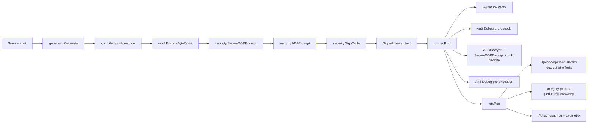
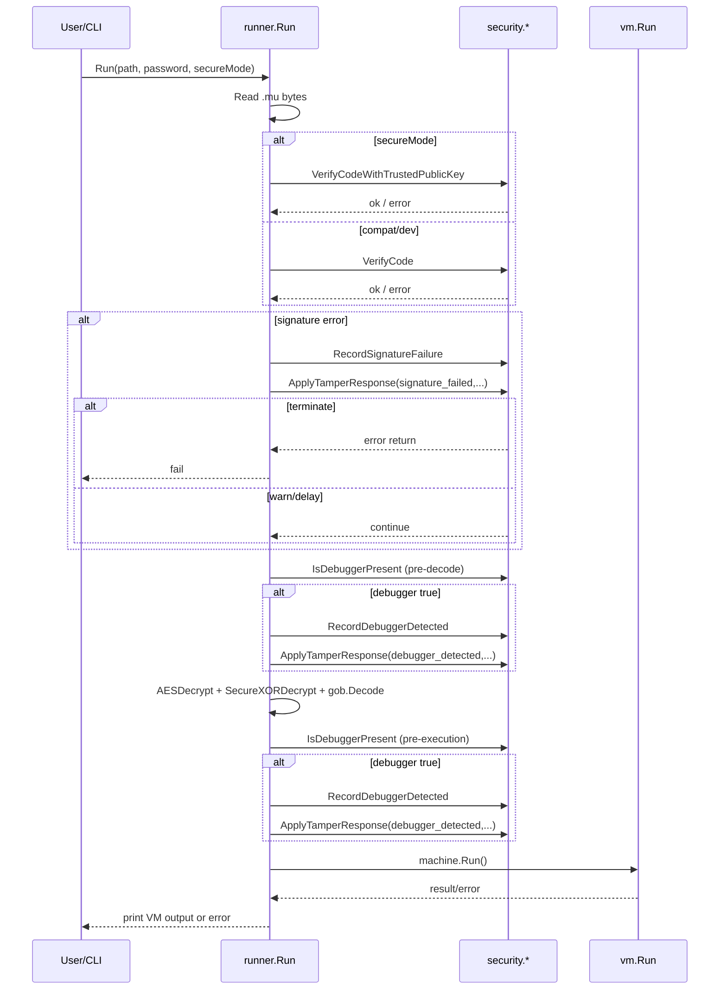
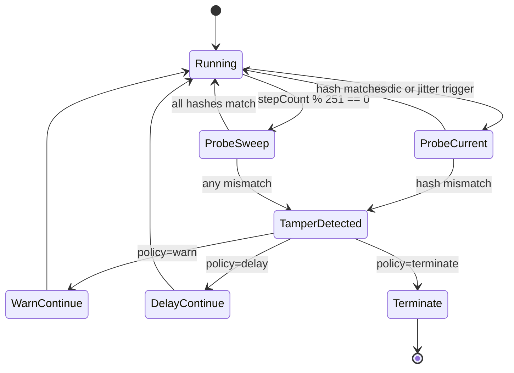
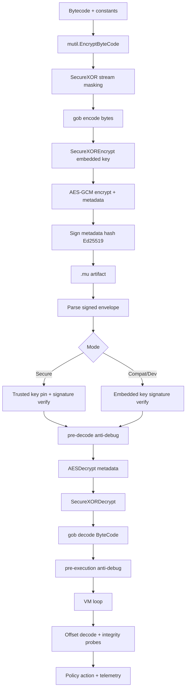

## 1. Document Purpose

This document defines the low-level security design for Mutant's bytecode
generation, signing, transport, loading, verification, runtime execution,
anti-debugging, integrity monitoring, and telemetry paths.

It is implementation-accurate to the current codebase and intended for:

- Security engineering and code reviews
- Incident response and operations enablement
- Regression prevention for future security changes
- Test strategy and CI policy enforcement

This LLD focuses on anti-tamper and anti-piracy controls under an offline-first
threat model.

---

## 2. Security Objectives

### 2.1 Primary Objectives

1. Ensure tampered artifacts are detected before or during execution.
2. Ensure secure mode is fail-closed by default.
3. Protect payload confidentiality and integrity at rest.
4. Reduce effectiveness of dynamic analysis/debugging.
5. Detect runtime instruction tampering and respond per policy.
6. Provide observable security signals via telemetry and audit output.

### 2.2 Non-Objectives

1. Absolute malware-grade anti-debug resistance (not possible in pure userland).
2. Hardware-rooted trust chain (not implemented yet).
3. Remote attestation and centralized key management (not implemented yet).

---

## 3. Threat Model

### 3.1 In Scope Adversary Capabilities

1. Reads and modifies `.mu` artifacts on disk.
2. Attempts re-signing with attacker-generated keypairs.
3. Runs runtime under debugger/instrumentation.
4. Patches bytecode/in-memory instruction regions.
5. Replays older artifacts or malformed payloads.
6. Manipulates environment variables at launch.

### 3.2 Out of Scope (Current Release)

1. Kernel-level adversaries with arbitrary memory write.
2. Hypervisor-level introspection attacks.
3. Physical attacks against hardware secrets.

---

## 4. Security Modes and Policy Semantics

Mutant currently has three practical launch postures:

1. Secure mode (`--secure`, default):

- Signature verification requires trusted signer pinning.
- Default tamper response is `terminate`.
- If trusted key env is not set, runtime bootstraps a local persistent keypair
  and uses the local public key as trusted key.

2. Compatibility mode (`--compat`):

- Signature verification uses embedded signer key (format validity only).
- Default tamper response is `warn`.

3. Developer mode (`--dev`):

- Runtime behavior is forced to compatibility mode.
- If no runtime password is supplied for `.mu`, default deterministic local
  password fallback is used (`mutil.GetPwd()`).
- Intended for local testing convenience, not production hardening.

### 4.3 Protection Profiles

Mutant also supports a protection profile layer via `MUTANT_PROTECTION_PROFILE`.

Supported values:

1. `minimal`

- Favors compatibility and operator convenience.
- Defaults tamper policy to `warn`.
- Defaults risky builtin groups to allow-all unless an explicit capability list
  is set.

2. `standard`

- Default profile when the env var is unset or invalid.
- Keeps secure mode fail-closed and compatibility mode warn-by-default.

3. `paranoid`

- Favors maximum tamper resistance.
- Defaults tamper policy to `terminate` regardless of secure or compat posture.

Profile precedence:

- Explicit `MUTANT_TAMPER_RESPONSE` still wins when set.
- Explicit `MUTANT_BUILTIN_CAPABILITIES` still wins when set.
- Profile selection only controls defaults.

### 4.1 Mode Resolution Rules

CLI precedence is "last matching mode flag wins" due to linear arg scanning.

- Encounter `--compat` or `--dev` -> mode becomes compatibility.
- Encounter `--secure` later -> mode becomes secure again.

### 4.2 Tamper Response Policy

Policy source: env variable `MUTANT_TAMPER_RESPONSE`.

Valid values:

- `warn`: log and continue
- `delay`: sleep then continue
- `terminate`: return error/fail

Defaults:

- secure mode: `terminate`
- compatibility/dev mode: `warn`

Delay tuning:

- `MUTANT_TAMPER_DELAY_MS` in `[0..5000]`
- fallback default: `250ms`

---

## 5. Component Architecture

### 5.1 Security-Critical Modules

1. `security/crypto.go`

- AES-GCM payload encryption/decryption
- metadata serialization/parsing

2. `security/kdf.go`

- Argon2id derivation and parameter validation
- deterministic HKDF utilities

3. `security/signing.go` + `security/signatures.go`

- Ed25519 signatures
- signed artifact envelope parse/verify
- trusted key pinning

4. `security/secure_random.go`

- ChaCha20 offset-aware stream masking
- secure compare/zeroing helpers

5. `security/response_policy.go`

- central tamper response decisions

6. `security/telemetry.go`

- counters, JSON snapshot/export, audit log

7. `security/antidebug_*.go`

- platform-specific debugger detection

8. `runner/runner.go`

- execution gate and staged enforcement

9. `vm/vm.go`

- runtime decode path + integrity probes + policy integration

10. `code/code.go`

- offset-aware operand reads

11. `object/secure_memory.go`

- secure wrappers and object offset conventions

---

## 6. Artifact Format and Cryptographic Construction

### 6.1 Signed Artifact Envelope (`.mu`)

Outer format:

`HEADER |-| ENCODED_DATA |-| SIGNATURE_HEX |-| PUBLIC_KEY_HEX |-| FOOTER`

Constants:

- `HEADER = MUT`
- `FOOTER = ANT`
- `OUTER_SEPERATOR = |-|`

Notes:

- Parser validates minimum parts and header/footer sentinels.
- Signature/public key are hex encoded.
- `ENCODED_DATA` is the serialized encryption metadata string.

### 6.1.1 Standalone Release Trailer

Release binaries produced by the generator append a standalone trailer after the
embedded runtime payload.

Current format version: V3

`MUTANTBC | version | payload_len | payload_sha256 | canary | profile_code | provenance_sha256`

Field details:

1. `version`

- V1 and V2 are accepted for legacy compatibility.
- V3 is the current emission format.

2. `payload_len`

- Big-endian `uint64` payload length.

3. `payload_sha256`

- SHA-256 over the embedded bytecode payload.

4. `canary`

- Short SHA-256 derived guard used to detect trailer corruption.

5. `profile_code`

- Encoded protection profile selected at build time.
- `1 = minimal`, `2 = standard`, `3 = paranoid`.

6. `provenance_sha256`

- SHA-256 over `payload || payload_sha256 || profile_code`.
- Used to detect tampering and mismatched release provenance.

Compatibility rules:

- Runner validates V3 first, then V2, then V1.
- V1 and V2 remain supported for older artifacts.
- V3 is required for new release builds.

### 6.2 Encrypted Metadata Payload

`ENCODED_DATA` format in password mode:

`ciphertext_b64 | salt_hex | <empty-sourcehash> | true | iter | memory | threads`

Deterministic mode variant stores `sourceHash` and `false`.

Constants:

- inner separator: `SEPERATOR = |`
- AEAD associated data: `ENCSIG = MUTANT`

### 6.3 Encryption Layers

Compilation encryption layering (current implementation):

1. VM bytecode and constants are stream-masked (`mutil.EncryptByteCode`,
   `SecureXOR`).
2. Full gob byte slice is XOR-wrapped with embedded random key
   (`SecureXOREncrypt`).
3. Result is AES-GCM encrypted using Argon2id-derived key (`AESEncrypt`).
4. Encrypted metadata is signed with Ed25519 (`SignCode`).

Rationale:

- AES-GCM gives confidentiality + integrity for payload.
- Signature protects authenticity and allows trusted signer pinning in secure
  mode.
- Additional stream/XOR layers increase analysis friction.

The standalone release trailer adds a separate provenance check path so the
runtime can validate the generated build profile and trailer integrity before
payload decode.

---

## 7. Key Derivation and Password Handling

### 7.1 Password KDF (Argon2id)

Derivation path:

- `DeriveKeyFromPassword(password, salt)`
- defaults:
  - time: 1
  - memory: 64 MB (`64*1024` KB)
  - threads: 4
  - key length: 32 bytes

Validation hard bounds:

- time: `[1..8]`
- memory: `[64MB..4GB]` in KB units
- threads: `[1..16]`

### 7.2 Password Quality Policy

Easy memorable passwords

### 7.3 Build-Time Profile Binding

Release generation binds the selected protection profile into the standalone
trailer via the `profile_code` field.

Security implication:

- The build mode becomes auditable in the emitted artifact.
- Trailer provenance mismatch is treated as tamper.
- Runtime behavior still honors explicit environment overrides for policy
  controls.

### 7.3 Deterministic Local Password Fallback

`mutil.GetPwd()` uses HKDF-SHA512 over fixed context constants to produce a
deterministic local key string.

Used when:

- Single-arg `.mut`/`.mu` convenience paths.
- `--dev` mode running `.mu` without explicit `-pwd`.

Security implication:

- deterministic and recoverable from binary/source; convenience only.
- not a production secret.

---

## 8. Signing and Trust Model

### 8.1 Signature Primitive

- Algorithm: Ed25519
- Signing input: SHA-256 hash of `ENCODED_DATA`

### 8.2 Verification Paths

1. Compatibility verification (`VerifyCode`):

- Parses embedded public key and signature.
- Verifies signature correctness for envelope integrity.
- Does not enforce signer identity trust.

2. Secure verification (`VerifyCodeWithTrustedPublicKey`):

- Parses embedded public key/signature.
- Loads trusted key from env `MUTANT_TRUSTED_PUBLIC_KEY_HEX` when set.
- Falls back to local key bootstrap resolution when env is absent.
- Constant-time compares embedded key with trusted key.
- On mismatch returns `ErrUntrustedSigner`.
- Verifies signature using trusted key.

### 8.3 Signing Key Injection

Build/signing key source:

- `MUTANT_SIGNING_PRIVATE_KEY_HEX` preferred for stable signer identity.
- If absent, local persistent keypair is loaded or bootstrapped from local
  keystore.

Operational risk:

- unmanaged local bootstrap keys can diverge from official release trust anchors
  if not governed by deployment policy.

---

## 9. Runtime Security Gate (`runner.Run`)

### 9.1 Telemetry Export Hook

If `MUTANT_SECURITY_TELEMETRY_FILE` is set, runner defers telemetry JSON export
at function exit.

### 9.2 Standalone Trailer Validation

Before signature verification and decode, runner performs standalone trailer
validation when the binary appears to carry an appended payload.

Validation order:

1. V3 trailer
2. V2 trailer
3. V1 trailer

Checks performed:

1. trailer marker and version
2. payload length bounds
3. payload SHA-256
4. canary (V2+)
5. profile code validity and provenance hash (V3)

Failure handling:

- checksum mismatch -> reject payload
- canary mismatch -> reject payload
- provenance mismatch -> reject payload
- unsupported trailer version -> reject payload

---

## 10. VM Runtime Protection Internals

### 10.1 Offset-Aware Instruction Decode

VM fetch path decrypts opcode/operands at exact stream offsets:

- opcode: `SecureXOROneAt(ins[ip], seed=inslen, password, offset=ip)`
- `uint16` operands: `ReadUint16(..., offset=ip+1)`
- `uint8` operands: `ReadUint8(..., offset=ip+1)`

Security effect:

- avoids fixed-position-independent keystream reuse.
- ties decrypt stream byte to logical position.

### 10.2 Runtime Integrity Baselines

- Each compiled function instruction slice gets SHA-256 baseline at
  registration.
- Main function baseline seeded at VM init.
- Additional function baselines registered when frames are pushed.

### 10.3 Probe Scheduler

`runIntegrityProbes()` triggers checks by schedule:

1. periodic: every `integrityEvery` steps (default 64)
2. jittered: when `stepCount % 97 == integrityJitter % 97`
3. sweep: every 251 steps checks all active frames

### 10.4 Integrity Response

If current instruction hash differs from expected baseline:

1. `RecordIntegrityFailure(stage)`
2. `ApplyTamperResponse(integrity_failed, stage, secureMode=true, err)`

Important implementation detail:

- VM currently calls tamper response with `secureMode=true` for integrity
  failures, making secure defaults (`terminate`) apply unless env override
  downgrades policy.

### 10.5 Builtin Capability Gating

Risky builtins are gated by explicit capability names and default policy from
the selected protection profile.

Current capability groups:

1. `command_exec`
2. `filesystem`
3. `network`

Behavior:

- `minimal` profile defaults to allow-all.
- `standard` and `paranoid` profiles default-deny the risky groups.
- Explicit `MUTANT_BUILTIN_CAPABILITIES` overrides the profile default.

---

## 11. In-Memory Object Protection

### 11.1 VM Stack/Object Paths

- `push()` attempts to encrypt objects before storing.
- `pop()` attempts to decrypt encrypted objects before use.
- arrays/hashes decrypt elements during construction.
- builtin call arguments decrypted before invocation.

### 11.2 Secure Wrappers (`object/secure_memory.go`)

Provided primitives:

1. `SecureGlobal`

- encrypted value storage, typed set/get, secure clear.

2. `SecureStack`

- optional auto-encrypt idle entries after timeout.

3. `SecureConstantPool`

- encrypted constants with cache.

### 11.3 Stream Offset Convention for Object Types

`objectStreamOffset`:

- integer -> 64
- string -> 128
- boolean -> 192
- default -> 256

Purpose:

- deterministic per-type stream segmentation and reduced overlap.

Limitations:

- plaintext exists transiently during runtime operations and conversions.
- Go string immutability limits guaranteed in-place wipe.

---

## 12. Anti-Debug Design

### 12.1 Entry Point

`IsDebuggerPresent()` dispatches by OS:

- windows -> `isDebuggerPresentWindows`
- linux -> `isDebuggerPresentLinux`
- darwin -> `isDebuggerPresentDarwin`

### 12.2 Windows Signals

High-confidence (single hit triggers):

1. `IsDebuggerPresent`
2. `CheckRemoteDebuggerPresent`
3. `NtQueryInformationProcess(ProcessDebugPort)`
4. `NtQueryInformationProcess(ProcessDebugObjectHandle)`

Low-confidence weak hits (threshold-based):

1. `OutputDebugString` timing anomaly
2. common debugger DLL presence

Decision rule:

- `shouldTriggerDebuggerByWeight(highConfidence, weakHits, weakThreshold=2)`

### 12.3 Linux Signals

1. `/proc/self/status` `TracerPid != 0`
2. parent commandline pattern matching for debugger/re tools
3. debugger-related env markers (`GDB_*`, `LLDB_*`, `VALGRIND_*`, `LD_PRELOAD`,
   etc.)

### 12.4 Darwin Signals

1. `sysctl` P_TRACED flag
2. parent process pattern match
3. debugging env markers (`LLDB_*`, `DYLD_INSERT_LIBRARIES`, etc.)

### 12.5 Enforcement Staging

Runner checks anti-debug at:

1. `pre-decode`
2. `pre-execution`

On detection:

- telemetry increment
- policy application (`warn`/`delay`/`terminate`)

---

## 13. Telemetry and Audit

### 13.1 Counters

Atomic counters:

1. `debugger_detected`
2. `integrity_failed`
3. `signature_failed`

### 13.2 APIs

1. `SecurityTelemetrySnapshot()` -> map
2. `SecurityTelemetryJSON()` -> serialized JSON
3. `ExportSecurityTelemetry(path)` -> file write mode `0600`
4. `ResetSecurityTelemetry()` -> test/ops reset

### 13.3 Audit Stream

If `MUTANT_SECURITY_AUDIT=1`, writes stderr event lines:

`[security-audit] ts=<unix> event=<...> stage=<...>`

---

## 14. Environment Variable Contract

### 14.1 Trust and Keys

1. `MUTANT_TRUSTED_PUBLIC_KEY_HEX`

- required in secure runtime mode
- trusted signer pinning key (ed25519 public key, hex)

2. `MUTANT_SIGNING_PRIVATE_KEY_HEX`

- optional generator signing private key
- stable artifact signer identity when set

3. `MUTANT_KEYSTORE_DIR`

- optional override for local key bootstrap directory
- defaults to `<home>/.mutant/keys`

### 14.2 Tamper Policy

1. `MUTANT_TAMPER_RESPONSE` = `warn|delay|terminate`
2. `MUTANT_TAMPER_DELAY_MS` = integer ms in `[0..5000]`

### 14.3 Observability

1. `MUTANT_SECURITY_AUDIT` = `1` to enable stderr audit lines
2. `MUTANT_SECURITY_TELEMETRY_FILE` = output path for telemetry JSON

---

## 15. Error and Failure Semantics

### 15.1 Canonical Security Errors

1. `ErrWrongSignature`
2. `ErrPasswordRequired`
3. `ErrInvalidMetadata`
4. `ErrDebuggerDetected`
5. `ErrUntrustedSigner`

### 15.2 Policy-Dependent Behavior

Same event can either:

1. terminate with original error (`terminate`)
2. continue with warning (`warn`)
3. continue after delay (`delay`)

### 15.3 Design Tradeoff

- Secure defaults maximize resistance but may impact debuggability.
- Compatibility/dev improves operator ergonomics but weakens security
  guarantees.

---

## 16. Detailed Dataflow

---

## 17. Testing and Verification Strategy

### 17.1 Unit/Integration Coverage Highlights

1. `security/security_test.go`

- trusted key pinning success/failure
- argon2 bounds validation
- stream XOR offset correctness
- telemetry counters/json/export
- policy defaults and response behavior
- compatibility mixed artifact behavior
- anti-debug weighting logic

2. `runner/runner_test.go`

- secure mode malformed/tampered payload rejection
- compatibility mode continue-on-signature-failure behavior

3. `vm/vm_security_policy_test.go`

- integrity tamper behavior under `warn`, `delay`, `terminate`

### 17.2 CI Security Profile

Workflow `.github/workflows/security-profile.yml`:

- strict env defaults (`terminate`, delay=0, audit=1)
- targeted security packages + VM policy test
- optional telemetry artifact upload

---

## 18. Security Invariants (Must Hold)

1. In secure mode, trusted public key must be configured or execution fails.
2. In secure mode, signature mismatch/untrusted signer must fail unless policy
   explicitly downgraded by env.
3. Integrity mismatch must always record telemetry before policy action.
4. Metadata parser must reject malformed Argon2 parameters.
5. Opcode/operand decode must stay offset-aware.
6. Telemetry export path must not fail open to panic.

---

## 19. Residual Risks and Limitations

1. Compatibility/dev mode can be misused in production if not controlled.
2. Env-driven policy downgrades (`warn`/`delay`) can reduce enforcement.
3. Userland anti-debug remains bypassable by binary patching.
4. No hardware trust anchor or attestation.
5. Deterministic fallback password is convenience-only and not secret.
6. Full Windows runtime integration tests on real CI runners remain pending.
7. Full compile-sign-run-tamper rerun lifecycle tests remain incomplete.

---

## 20. Operational Guidance

### 20.1 Recommended Production Baseline

1. Launch with `--secure` only.
2. Set `MUTANT_TRUSTED_PUBLIC_KEY_HEX` to release signer key.
3. Set `MUTANT_TAMPER_RESPONSE=terminate`.
4. Set `MUTANT_TAMPER_DELAY_MS=0` unless delay strategy is intentional.
5. Enable telemetry export and audit in monitored environments.

### 20.2 Developer Baseline

1. Use `--dev` for local test convenience only.
2. Avoid using `--dev` artifacts/behavior as production acceptance signal.
3. Keep test environment policy explicit to avoid accidental drift.

---

## 21. Future Hardening Backlog (LLD-Level)

1. Add compile-sign-run-tamper-rerun end-to-end suites.
2. Add real Windows runner-based anti-debug integration tests.
3. Add signer key rotation and multi-key trust set support.
4. Add self-integrity hashing of selected runtime text/function regions.
5. Add policy lock mode to ignore environment downgrades in production builds.
6. Consider hardware-backed key protection for signing workflows.
7. Expand telemetry schema with per-event reason codes and monotonic sequence
   IDs.

---

## 22. Appendix A: Key Functions by Responsibility

### Build-Time

1. `generator.Generate`
2. `generator.encryptCode`
3. `security.AESEncrypt`
4. `security.SignCode`

### Run-Time Gate

1. `runner.Run`
2. `runner.enforceAntiDebug`
3. `runner.decryptCode`

### Runtime VM

1. `vm.Run`
2. `vm.runIntegrityProbes`
3. `vm.verifyFrameIntegrity`

### Security Core

1. `security.VerifyCode`
2. `security.VerifyCodeWithTrustedPublicKey`
3. `security.ApplyTamperResponse`
4. `security.Record*` telemetry APIs
5. `security.IsDebuggerPresent`

---

## 23. Appendix B: Mode/Policy Decision Table

| Execution Posture          | Signature Verification Path  | Default Policy | Wrong Signature / Untrusted Key        | Debugger Hit                           | Integrity Mismatch                     |
| -------------------------- | ---------------------------- | -------------- | -------------------------------------- | -------------------------------------- | -------------------------------------- |
| Secure (`--secure`)        | Trusted key pinning required | terminate      | stop by default (unless env downgrade) | stop by default (unless env downgrade) | stop by default (unless env downgrade) |
| Compatibility (`--compat`) | Embedded key verification    | warn           | continue/log by default                | continue/log by default                | continue/log by default                |
| Developer (`--dev`)        | Compatibility path forced    | warn           | continue/log by default                | continue/log by default                | continue/log by default                |

---

## 24. Appendix C: Design Review Checklist

1. Any new security check records telemetry before response.
2. Any new response path uses `ApplyTamperResponse` consistently.
3. Any new opcode/operand decode remains offset-aware.
4. Any metadata schema changes preserve strict parse/validation behavior.
5. Any new compatibility shortcut is explicitly blocked in secure mode.
6. Any CI changes preserve targeted security profile execution.

---

End of document.
