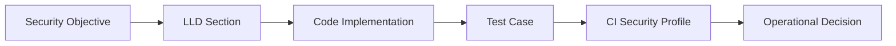
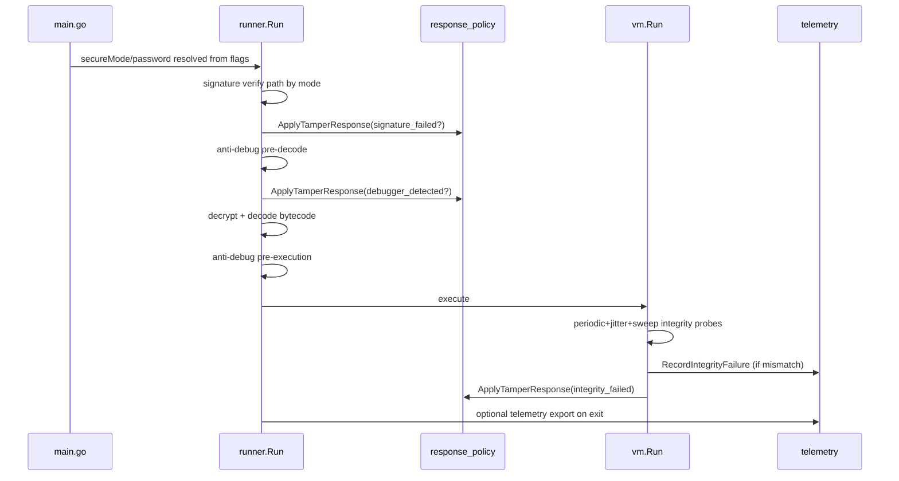

## 1. Purpose

This document provides end-to-end traceability from security design intent to
concrete implementation and validation.

It maps:

1. Security requirements and controls
2. Implementation anchors (functions/files)
3. Runtime configuration surfaces (flags/env)
4. Test coverage and CI enforcement
5. Residual gaps and next validation actions

---

## 2. Traceability Model

Evidence levels used in this matrix:

- `I` = implemented
- `T` = tested
- `C` = CI wired
- `P` = partial / pending depth

---

## 3. Security Control Matrix

| ID      | Control Requirement                                                                | LLD Area                      | Implementation Anchors                                                                                                                                                                                                                                                                                                          | Config Surface                                            | Tests / CI Evidence                                                                                                                                                                                                         | Status |
| ------- | ---------------------------------------------------------------------------------- | ----------------------------- | ------------------------------------------------------------------------------------------------------------------------------------------------------------------------------------------------------------------------------------------------------------------------------------------------------------------------------- | --------------------------------------------------------- | --------------------------------------------------------------------------------------------------------------------------------------------------------------------------------------------------------------------------- | ------ |
| SEC-001 | Signed artifact envelope must be parsed and verified before execution              | Artifact format + trust model | [security/signatures.go](security/signatures.go#L33), [security/signatures.go](security/signatures.go#L54), [security/signatures.go](security/signatures.go#L98), [runner/runner.go](runner/runner.go#L27)                                                                                                                      | Mode-driven path: `--secure` / `--compat` / `--dev`       | [security/security_test.go](security/security_test.go#L101), [runner/runner_test.go](runner/runner_test.go#L13), [.github/workflows/security-profile.yml](.github/workflows/security-profile.yml#L1)                        | I/T/C  |
| SEC-002 | Secure mode must pin signer identity to trusted key                                | Secure mode semantics         | [runner/runner.go](runner/runner.go#L27), [security/signatures.go](security/signatures.go#L54), [security/const.go](security/const.go#L12)                                                                                                                                                                                      | `MUTANT_TRUSTED_PUBLIC_KEY_HEX`                           | [security/security_test.go](security/security_test.go#L122), [runner/runner_test.go](runner/runner_test.go#L45)                                                                                                             | I/T/C  |
| SEC-003 | Signature failure handling must be policy-driven                                   | Tamper response policy        | [runner/runner.go](runner/runner.go#L35), [runner/runner.go](runner/runner.go#L43), [security/response_policy.go](security/response_policy.go#L34)                                                                                                                                                                              | `MUTANT_TAMPER_RESPONSE`                                  | [security/security_test.go](security/security_test.go#L295), [runner/runner_test.go](runner/runner_test.go#L30)                                                                                                             | I/T/C  |
| SEC-004 | Payload confidentiality and integrity at rest must use AEAD                        | Crypto layer                  | [security/crypto.go](security/crypto.go#L29), [security/crypto.go](security/crypto.go#L132), [security/const.go](security/const.go#L9)                                                                                                                                                                                          | Password input and metadata                               | indirect via runner decode path tests [runner/runner_test.go](runner/runner_test.go#L76)                                                                                                                                    | I/T/P  |
| SEC-005 | Password-based key derivation must use bounded Argon2id params                     | KDF hardening                 | [security/kdf.go](security/kdf.go#L42), [security/kdf.go](security/kdf.go#L97), [security/crypto.go](security/crypto.go#L196)                                                                                                                                                                                                   | password mode + metadata fields                           | [security/security_test.go](security/security_test.go#L147)                                                                                                                                                                 | I/T    |
| SEC-006 | Password quality policy required when explicit password mode is used               | Password policy               | [security/kdf.go](security/kdf.go#L73), [generator/generate.go](generator/generate.go#L26)                                                                                                                                                                                                                                      | `-password` / `-pwd`                                      | covered by generator path behavior and policy validation unit scope                                                                                                                                                         | I/P    |
| SEC-007 | Runtime instruction decode must be offset-aware to reduce keystream reuse          | VM decode hardening           | [vm/vm.go](vm/vm.go#L90), [code/code.go](code/code.go#L177), [code/code.go](code/code.go#L190), [security/secure_random.go](security/secure_random.go#L39)                                                                                                                                                                      | runtime password/seed context                             | [security/security_test.go](security/security_test.go#L179), [security/security_test.go](security/security_test.go#L197)                                                                                                    | I/T/C  |
| SEC-008 | Runtime integrity checks must detect instruction tampering                         | VM integrity probes           | [vm/vm.go](vm/vm.go#L333), [vm/vm.go](vm/vm.go#L662), [vm/vm.go](vm/vm.go#L681)                                                                                                                                                                                                                                                 | policy + secure default behavior                          | [vm/vm_security_policy_test.go](vm/vm_security_policy_test.go#L11)                                                                                                                                                          | I/T/C  |
| SEC-009 | Integrity failures must trigger telemetry and policy action                        | Telemetry + policy coupling   | [vm/vm.go](vm/vm.go#L697), [security/telemetry.go](security/telemetry.go#L25), [security/response_policy.go](security/response_policy.go#L34)                                                                                                                                                                                   | `MUTANT_TAMPER_RESPONSE`                                  | [vm/vm_security_policy_test.go](vm/vm_security_policy_test.go#L21), [vm/vm_security_policy_test.go](vm/vm_security_policy_test.go#L41), [vm/vm_security_policy_test.go](vm/vm_security_policy_test.go#L59)                  | I/T/C  |
| SEC-010 | Anti-debug checks must be staged before decode and before execution                | Runtime gate enforcement      | [runner/runner.go](runner/runner.go#L49), [runner/runner.go](runner/runner.go#L58), [runner/runner.go](runner/runner.go#L67)                                                                                                                                                                                                    | mode + tamper response env                                | policy behavior tests [security/security_test.go](security/security_test.go#L295)                                                                                                                                           | I/T/P  |
| SEC-011 | Debugger detection must be platform-specific with weighted signal logic on Windows | Anti-debug platform design    | [security/antidebug.go](security/antidebug.go#L29), [security/antidebug_windows.go](security/antidebug_windows.go#L32), [security/antidebug_weighting.go](security/antidebug_weighting.go#L3), [security/antidebug_linux.go](security/antidebug_linux.go#L15), [security/antidebug_darwin.go](security/antidebug_darwin.go#L17) | runtime OS selection                                      | [security/security_test.go](security/security_test.go#L349)                                                                                                                                                                 | I/T/P  |
| SEC-012 | Security telemetry must support atomic counters and secure export                  | Telemetry subsystem           | [security/telemetry.go](security/telemetry.go#L20), [security/telemetry.go](security/telemetry.go#L35), [security/telemetry.go](security/telemetry.go#L48)                                                                                                                                                                      | `MUTANT_SECURITY_AUDIT`, `MUTANT_SECURITY_TELEMETRY_FILE` | [security/security_test.go](security/security_test.go#L205), [security/security_test.go](security/security_test.go#L230), CI export in [.github/workflows/security-profile.yml](.github/workflows/security-profile.yml#L30) | I/T/C  |
| SEC-013 | CLI must clearly resolve secure/compat/dev mode and developer fallback semantics   | CLI posture controls          | [main.go](main.go#L165), [main.go](main.go#L180), [main.go](main.go#L118), [main.go](main.go#L129)                                                                                                                                                                                                                              | `--secure`, `--compat`, `--dev`, `-pwd`                   | operationally validated in local runtime use; no dedicated CLI parsing tests yet                                                                                                                                            | I/P    |
| SEC-014 | Generator must support stable signing identity via environment key                 | Signing workflow              | [generator/generate.go](generator/generate.go#L35), [generator/generate.go](generator/generate.go#L75), [security/const.go](security/const.go#L13)                                                                                                                                                                              | `MUTANT_SIGNING_PRIVATE_KEY_HEX`                          | indirectly validated by signature verification tests                                                                                                                                                                        | I/P    |
| SEC-015 | Security-focused CI profile must run targeted hardening suites                     | CI control plane              | [.github/workflows/security-profile.yml](.github/workflows/security-profile.yml#L1), [.github/workflows/security-profile.yml](.github/workflows/security-profile.yml#L23)                                                                                                                                                       | CI env defaults and artifact upload                       | workflow itself + package tests invoked by CI                                                                                                                                                                               | I/C    |
| SEC-016 | Protection profile must define default tamper and builtin policy behavior          | Runtime policy profile        | [security/profile.go](security/profile.go), [security/response_policy.go](security/response_policy.go), [builtin/capabilities.go](builtin/capabilities.go)                                                                                                                                                                      | `MUTANT_PROTECTION_PROFILE`                               | [security/security_test.go](security/security_test.go), [builtin/capabilities_test.go](builtin/capabilities_test.go)                                                                                                        | I/T    |
| SEC-017 | Risky builtins must be capability-gated by explicit allow-list                     | Builtin capability gates      | [builtin/builtin.go](builtin/builtin.go), [builtin/command_exec.go](builtin/command_exec.go), [builtin/fs.go](builtin/fs.go), [builtin/net.go](builtin/net.go), [builtin/http.go](builtin/http.go)                                                                                                                              | `MUTANT_BUILTIN_CAPABILITIES`                             | [builtin/command_exec_test.go](builtin/command_exec_test.go), [builtin/capabilities_test.go](builtin/capabilities_test.go)                                                                                                  | I/T    |
| SEC-018 | Standalone release artifacts must carry profile attestation and provenance         | Release trailer attestation   | [generator/writebinary.go](generator/writebinary.go), [runner/runner.go](runner/runner.go), [security/profile.go](security/profile.go), [security/const.go](security/const.go)                                                                                                                                                  | build profile + release generation path                   | [runner/runner_test.go](runner/runner_test.go)                                                                                                                                                                              | I/T    |

---

## 4. Runtime Decision Trace

---

## 5. Environment and Flag Traceability

### 5.1 Execution Flags

1. `--secure` / `-secure`

- default secure posture selector and explicit override
- anchor: [main.go](main.go#L173)

2. `--compat` / `-compat`

- compatibility posture selector
- anchor: [main.go](main.go#L171)

3. `--dev` / `-dev`

- compatibility posture + default local password fallback for `.mu` when
  password omitted
- anchors: [main.go](main.go#L169), [main.go](main.go#L129)

4. `-password`, `-pwd`, `--password=`, `--pwd=`

- explicit password extraction
- anchor: [main.go](main.go#L190)

### 5.2 Environment Variables

1. `MUTANT_TRUSTED_PUBLIC_KEY_HEX`

- secure runtime signer pinning requirement
- anchors: [security/const.go](security/const.go#L12),
  [runner/runner.go](runner/runner.go#L28)

2. `MUTANT_SIGNING_PRIVATE_KEY_HEX`

- stable build-time signer private key source
- anchors: [security/const.go](security/const.go#L13),
  [generator/generate.go](generator/generate.go#L75)

3. `MUTANT_TAMPER_RESPONSE`

- central response mode selection
- anchor: [security/response_policy.go](security/response_policy.go#L13)

4. `MUTANT_TAMPER_DELAY_MS`

- delay mode sleep tuning
- anchor: [security/response_policy.go](security/response_policy.go#L14)

5. `MUTANT_SECURITY_AUDIT`

- audit stderr event toggle
- anchor: [security/telemetry.go](security/telemetry.go#L11)

6. `MUTANT_SECURITY_TELEMETRY_FILE`

- telemetry JSON export target path
- anchors: [security/telemetry.go](security/telemetry.go#L12),
  [runner/runner.go](runner/runner.go#L19)

---

## 6. Test Coverage Map by Attack Scenario

| Attack Scenario                                   | Expected Security Behavior                                          | Primary Tests                                                                                                            |
| ------------------------------------------------- | ------------------------------------------------------------------- | ------------------------------------------------------------------------------------------------------------------------ |
| malformed `.mu` envelope in secure mode           | reject before decode                                                | [runner/runner_test.go](runner/runner_test.go#L13)                                                                       |
| malformed envelope in compat mode                 | policy may continue; fail later during decode                       | [runner/runner_test.go](runner/runner_test.go#L30)                                                                       |
| tampered signer identity                          | secure mode rejects untrusted signer                                | [runner/runner_test.go](runner/runner_test.go#L45), [security/security_test.go](security/security_test.go#L122)          |
| trusted signer valid but payload unusable         | signature path passes, decode fails correctly                       | [runner/runner_test.go](runner/runner_test.go#L76)                                                                       |
| integrity tamper under `warn/delay/terminate`     | policy-specific continue/fail behavior with telemetry increment     | [vm/vm_security_policy_test.go](vm/vm_security_policy_test.go#L11)                                                       |
| response policy default/override correctness      | secure default terminate, compat default warn, env override honored | [security/security_test.go](security/security_test.go#L275), [security/security_test.go](security/security_test.go#L295) |
| stream-mask roundtrip and offset byte correctness | decryptability and offset-specific correctness                      | [security/security_test.go](security/security_test.go#L179), [security/security_test.go](security/security_test.go#L197) |
| telemetry JSON/export correctness                 | counters and file export valid                                      | [security/security_test.go](security/security_test.go#L205), [security/security_test.go](security/security_test.go#L230) |
| windows weak/high-confidence weighting            | threshold behavior stable                                           | [security/security_test.go](security/security_test.go#L349)                                                              |

---

## 7. Known Traceability Gaps

The following areas are represented in LLD but only partially evidenced at
integration depth:

1. Real Windows runner integration execution with genuine debugger signals (`P`
   depth remains).
2. Full compile -> sign -> run -> tamper -> rerun lifecycle integration suite.
3. Dedicated CLI flag parsing tests for secure/compat/dev precedence.
4. Explicit unit coverage for generator password complexity rejection path.
5. Signed-key rotation lifecycle tests (multi-key trust/rollover not yet
   implemented).

---

## 8. Recommended Validation Backlog

1. Add `main` CLI parsing tests covering mixed mode flag order and dev fallback
   behavior.
2. Add e2e fixture tests that produce real `.mu` artifacts and validate tamper
   outcomes in all policies.
3. Add a Windows CI job for runtime anti-debug policy verification on
   hosted/self-hosted runner.
4. Add negative tests for malformed `MUTANT_TRUSTED_PUBLIC_KEY_HEX` and
   `MUTANT_SIGNING_PRIVATE_KEY_HEX` values in integration context.
5. Add deterministic artifact compatibility tests to guard accidental
   secure/compat behavior drift.

---

## 9. Quick Audit Checklist (Reviewer Use)

1. Secure mode launch path requires trusted key env and fails if absent.
2. Any signature, debugger, or integrity event routes through policy layer.
3. Telemetry increments occur before policy returns error on terminate.
4. VM operand/opcode decode remains offset-aware.
5. CI security profile still executes targeted suites with strict defaults.
6. Dev mode remains explicit and does not silently alter secure mode defaults
   unless chosen.

---

End of document.
