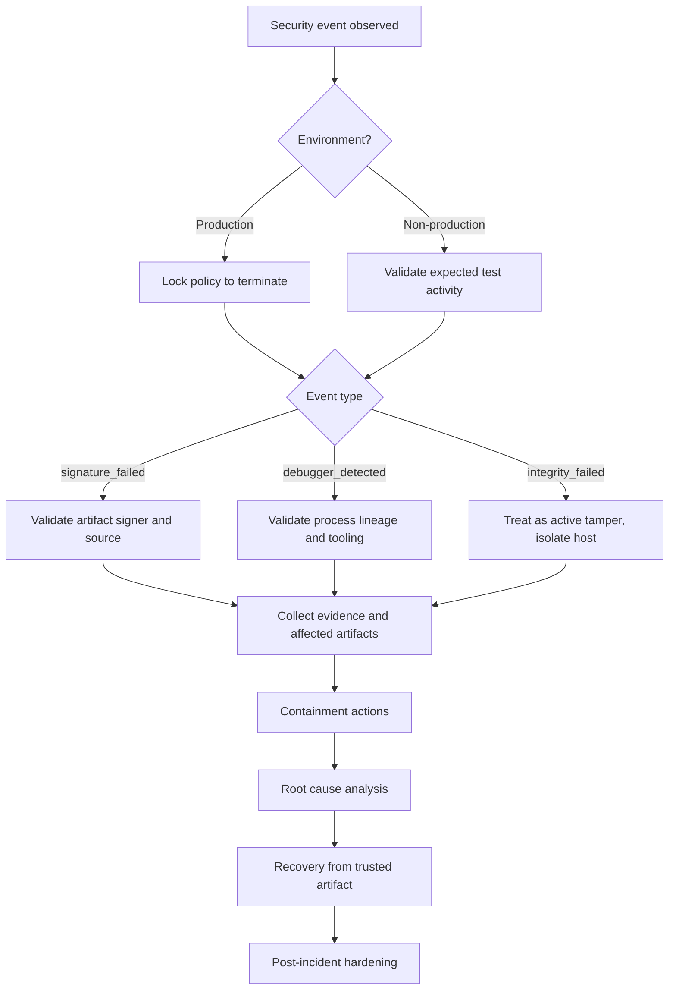

## 1. Purpose

This runbook defines how to detect, triage, contain, remediate, and recover from
security-relevant runtime events produced by Mutant.

It operationalizes controls documented in SECURITY_LLD.md and
SECURITY_LLD_TRACEABILITY.md.

Primary event classes:

1. signature_failed
2. debugger_detected
3. integrity_failed

---

## 2. Operational Objectives

1. Minimize time to detect active tamper activity.
2. Ensure consistent incident handling across environments.
3. Preserve forensic evidence before destructive actions.
4. Prevent insecure policy downgrades during response.
5. Restore trusted runtime service safely.

---

## 3. Runtime Controls and Signals

### 3.1 Policy Inputs

1. MUTANT_TAMPER_RESPONSE

- warn
- delay
- terminate

2. MUTANT_TAMPER_DELAY_MS

- delay in milliseconds when policy is delay
- valid range: 0 to 5000

3. MUTANT_SECURITY_AUDIT

- set to 1 to emit audit log lines to stderr

4. MUTANT_SECURITY_TELEMETRY_FILE

- path where telemetry JSON is exported on process exit

5. MUTANT_TRUSTED_PUBLIC_KEY_HEX

- required for secure mode signer pinning

### 3.2 Telemetry Counters

1. debugger_detected
2. integrity_failed
3. signature_failed

### 3.3 Audit Event Format

Audit lines are emitted as:

[security-audit] ts=<unix> event=<event_name> stage=<stage_name>

Policy action lines are emitted as:

[security] event=<event_name> stage=<stage_name> action=<warn_or_delay>

---

## 4. Severity and Classification

| Event             | Typical Meaning                                   | Severity Baseline | Escalation Conditions                                                                    |
| ----------------- | ------------------------------------------------- | ----------------- | ---------------------------------------------------------------------------------------- |
| signature_failed  | malformed, tampered, or untrusted signed artifact | High              | secure mode production, repeated across hosts, signer mismatch in release ring           |
| debugger_detected | debugger or instrumentation indicators in runtime | Medium            | production process, repeated detections, correlated with signature or integrity failures |
| integrity_failed  | runtime code/instruction hash mismatch            | Critical          | any production hit, especially with concurrent signature failures                        |

Environment adjustment:

1. Development or CI may downgrade one level when explicitly expected.
2. Production never downgrades integrity_failed below High.

---

## 5. Decision Flow



---

## 6. First 15 Minutes Checklist

1. Confirm environment and blast radius.
2. Capture exact error output and event stage.
3. Save telemetry JSON and stderr logs before restart.
4. Record active policy values and command line flags used.
5. Preserve suspect artifact file hash and copy.
6. Determine whether issue is isolated or fleet-wide.
7. If production and integrity_failed occurs, isolate host immediately.

---

## 7. Evidence Collection Procedure

## 7.1 Required Evidence Set

1. Runtime stderr output including security and security-audit lines.
2. Telemetry snapshot JSON file.
3. Hashes of suspect .mu artifact and executable binary.
4. Process launch command and environment values used.
5. Host metadata: OS, hostname, timestamp, user context.

## 7.2 PowerShell Collection Example

Create an incident folder and capture hashes and environment:

```powershell
$ts = Get-Date -Format "yyyyMMdd-HHmmss"
$dir = "./incident-$ts"
New-Item -ItemType Directory -Path $dir | Out-Null

Get-ChildItem Env:MUTANT_* | Out-File "$dir/env.txt"
Get-FileHash .\mutant.exe -Algorithm SHA256 | Out-File "$dir/hashes.txt"
Get-FileHash .\examples\code.mu -Algorithm SHA256 | Out-File "$dir/hashes.txt" -Append

if (Test-Path .\telemetry.json) { Copy-Item .\telemetry.json "$dir/telemetry.json" }
```

## 7.3 Linux Collection Example

```bash
ts=$(date +%Y%m%d-%H%M%S)
dir=incident-$ts
mkdir -p "$dir"
env | grep '^MUTANT_' > "$dir/env.txt"
sha256sum ./mutant ./examples/code.mu > "$dir/hashes.txt"
[ -f ./telemetry.json ] && cp ./telemetry.json "$dir/telemetry.json"
```

---

## 8. Playbook A: signature_failed

### 8.1 Trigger Conditions

1. secure-mode-verify stage failure
2. compat-mode-verify stage failure
3. trusted key mismatch errors

### 8.2 Immediate Actions

1. Record event stage and policy action.
2. In production, enforce terminate policy immediately.
3. Verify MUTANT_TRUSTED_PUBLIC_KEY_HEX value and release key registry.
4. Compare artifact signer identity with expected release signer.

### 8.3 Triage Questions

1. Is failure isolated to one artifact or all freshly deployed artifacts?
2. Did signing key rotate recently?
3. Was artifact fetched from trusted release pipeline?
4. Is this compat mode expected behavior during testing only?

### 8.4 Containment

1. Quarantine suspect artifact.
2. Block further rollout from source channel until signer chain is confirmed.
3. Force secure mode with terminate policy in all production launch paths.

### 8.5 Recovery

1. Redeploy artifact signed by trusted current key.
2. Re-run verification in secure mode.
3. Confirm telemetry counter stops increasing after replacement.

### 8.6 Escalation

Escalate to Security Incident Commander if:

1. repeated signature failures across multiple hosts
2. trusted key mismatch after expected release deployment
3. any evidence of unauthorized signing key usage

---

## 9. Playbook B: debugger_detected

### 9.1 Trigger Conditions

1. pre-decode stage detection
2. pre-execution stage detection

### 9.2 Immediate Actions

1. Determine whether host is production or controlled test environment.
2. Capture parent process, command line, and environment markers.
3. Validate whether approved diagnostic tooling was active.

### 9.3 Triage Questions

1. Is debugger activity expected for this host role?
2. Did detection coincide with signature or integrity failures?
3. Are detections persistent across restarts?
4. Was this event introduced after policy/config change?

### 9.4 Containment

1. Production: terminate process and isolate if suspicious.
2. Disable unauthorized interactive debugging on production hosts.
3. Rotate credentials or access tokens if host compromise is suspected.

### 9.5 Recovery

1. Restart from clean artifact on clean host context.
2. Verify no further debugger detections over monitoring window.
3. Keep policy at terminate in production unless explicit temporary exception
   approved.

### 9.6 False Positive Handling

1. Confirm OS-specific detection source.
2. Document approved tools and process names for engineering.
3. Do not weaken global policy; use temporary scoped exception with expiration.

---

## 10. Playbook C: integrity_failed

### 10.1 Trigger Conditions

1. vm-frame stage mismatch
2. vm-frame-sweep stage mismatch

### 10.2 Immediate Actions

1. Treat as potential active tamper.
2. Isolate host from lateral communication paths.
3. Preserve memory and process evidence where policy allows.
4. Capture suspicious artifact and runtime binary hashes.

### 10.3 Triage Questions

1. Is this reproducible with same artifact on known-clean host?
2. Is there concurrent debugger_detected or signature_failed increase?
3. Were binary patches, hooks, or instrumentation frameworks present?

### 10.4 Containment

1. Force terminate policy globally for impacted environment.
2. Pull host from serving traffic or execution pool.
3. Block artifact source if tampered distribution is suspected.

### 10.5 Recovery

1. Rebuild and redeploy from trusted pipeline output.
2. Re-verify signatures and secure mode launch config.
3. Reintroduce host only after clean validation run.

### 10.6 Executive Escalation

Always escalate integrity_failed in production to critical severity.

---

## 11. Standard Commands for Validation

## 11.1 Secure Baseline Validation

Windows PowerShell:

```powershell
$env:MUTANT_TRUSTED_PUBLIC_KEY_HEX = "<trusted_pubkey_hex>"
$env:MUTANT_TAMPER_RESPONSE = "terminate"
$env:MUTANT_TAMPER_DELAY_MS = "0"
$env:MUTANT_SECURITY_AUDIT = "1"
$env:MUTANT_SECURITY_TELEMETRY_FILE = ".\telemetry.json"

.\mutant.exe .\examples\code.mu -pwd "<password>" --secure
```

## 11.2 Dev and Test Baseline

```powershell
$env:MUTANT_TAMPER_RESPONSE = "warn"
$env:MUTANT_SECURITY_AUDIT = "1"
$env:MUTANT_SECURITY_TELEMETRY_FILE = ".\telemetry.json"

.\mutant.exe .\examples\code.mu --dev
```

## 11.3 Targeted Security Test Execution

```powershell
go test ./security ./runner ./object ./code ./mutil ./generator ./cli -count=1
go test ./vm -run TestVMIntegrityTamperResponseModes -count=1
```

## 11.4 Key Bootstrap, Migration, and Rotation

Purpose:

1. Enable easy first-time secure mode use with local bootstrap keys.
2. Provide a controlled path to move from local keys to centrally managed
   release keys.
3. Rotate trusted signer keys without breaking production unexpectedly.

Local bootstrap behavior summary:

1. If MUTANT_TRUSTED_PUBLIC_KEY_HEX is absent in secure mode, runtime loads or
   creates a local Ed25519 keypair.
2. If MUTANT_SIGNING_PRIVATE_KEY_HEX is absent at generation time, generator
   loads or creates the same local keypair.
3. Local key directory defaults to home/.mutant/keys and can be overridden with
   MUTANT_KEYSTORE_DIR.

Key files:

1. ed25519_private_key.hex
2. ed25519_public_key.hex

Step A: Inspect or initialize local bootstrap keys

Windows PowerShell:

```powershell
if (-not $env:MUTANT_KEYSTORE_DIR) {
  $env:MUTANT_KEYSTORE_DIR = Join-Path $HOME ".mutant\keys"
}

Write-Host "Keystore:" $env:MUTANT_KEYSTORE_DIR
Get-ChildItem $env:MUTANT_KEYSTORE_DIR -ErrorAction SilentlyContinue
```

If files do not exist, run one secure execution once to bootstrap:

```powershell
.\mutant.exe .\examples\code.mu -pwd "<password>" --secure
```

Step B: Promote local public key to explicit trusted pinning

```powershell
$pubPath = Join-Path $env:MUTANT_KEYSTORE_DIR "ed25519_public_key.hex"
$env:MUTANT_TRUSTED_PUBLIC_KEY_HEX = (Get-Content $pubPath -Raw).Trim()
```

Step C: Promote local private key to explicit signing identity

```powershell
$privPath = Join-Path $env:MUTANT_KEYSTORE_DIR "ed25519_private_key.hex"
$env:MUTANT_SIGNING_PRIVATE_KEY_HEX = (Get-Content $privPath -Raw).Trim()
```

Step D: Rotate signer keys safely

1. Generate new keypair in a controlled environment.
2. Re-sign artifacts with the new private key.
3. Roll out MUTANT_TRUSTED_PUBLIC_KEY_HEX update before or atomically with
   artifact rollout.
4. Validate secure execution on canary hosts.
5. Expand rollout to full fleet after canary success.

Step E: Rollback plan for failed rotation

1. Revert MUTANT_TRUSTED_PUBLIC_KEY_HEX to previous trusted key.
2. Redeploy last known-good artifacts signed with prior key.
3. Confirm signature_failed counters return to baseline.

Governance requirements:

1. Production should use explicit env-pinned trusted key, not implicit local
   bootstrap, after initial setup.
2. Protect private key files with least privilege and restricted host access.
3. Never commit key files to source control.
4. Record key fingerprint, owner, and activation date in release records.

---

## 12. Communication Templates

## 12.1 Initial Incident Notification

Subject: Mutant Security Event Detected - <event> - <env>

Body:

1. Event type and stage:
2. First seen time and host count:
3. Current policy and mode:
4. User impact assessment:
5. Immediate containment actions taken:
6. Next update ETA:

## 12.2 Containment Complete Update

1. Scope and affected systems:
2. Evidence preserved:
3. Root cause hypothesis:
4. Temporary mitigations active:
5. Risks still open:

## 12.3 Recovery Complete Update

1. Recovery actions completed:
2. Validation checks passed:
3. Remaining monitoring window:
4. Follow-up hardening items:

---

## 13. RACI

| Activity                  | Security Engineering | Runtime Engineering | Release Engineering | Incident Commander |
| ------------------------- | -------------------- | ------------------- | ------------------- | ------------------ |
| Triage                    | A/R                  | R                   | C                   | C                  |
| Containment               | A                    | R                   | C                   | R                  |
| Key and signer validation | A/R                  | C                   | R                   | C                  |
| Recovery deployment       | C                    | R                   | A/R                 | C                  |
| Postmortem and hardening  | A/R                  | R                   | C                   | A                  |

Legend: A = Accountable, R = Responsible, C = Consulted

---

## 14. Post-Incident Requirements

1. Complete timeline with UTC timestamps.
2. Root cause analysis with evidence references.
3. Control gap assessment against LLD and traceability matrix.
4. Action items with owners and due dates.
5. Regression tests added for the discovered failure mode.

---

## 15. Hardening Guardrails During Incidents

1. Do not permanently downgrade policy to warn in production.
2. Do not disable signer pinning in secure environments.
3. Do not discard suspect artifacts before hash and copy preservation.
4. Do not close incident until telemetry stabilizes for agreed window.

---

## 16. Suggested Monitoring Thresholds

1. signature_failed > 0 in production over 5 minutes: High alert.
2. debugger_detected >= 3 on same host over 10 minutes: High alert.
3. integrity_failed >= 1 in production: Critical alert.
4. combined signature_failed and integrity_failed in same host window: Critical
   plus host isolation.

---

## 17. Runbook Maintenance

1. Review monthly or after any security architecture change.
2. Revalidate command snippets quarterly.
3. Run tabletop exercise at least once per quarter.
4. Update escalation contacts and ownership on every org change.

---

## 18. Cross-Reference

1. SECURITY_LLD.md
2. SECURITY_LLD_TRACEABILITY.md
3. review.md
4. .github/workflows/security-profile.yml

---

End of document.
